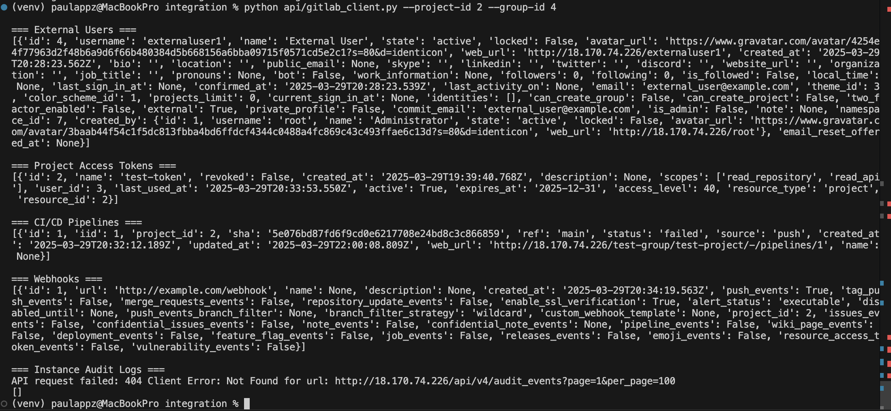
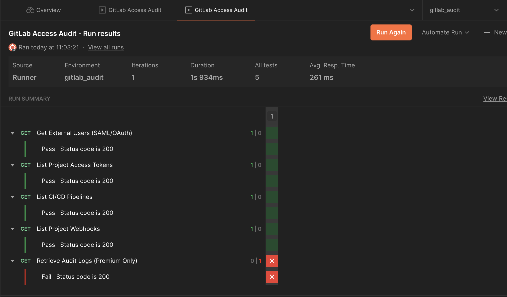
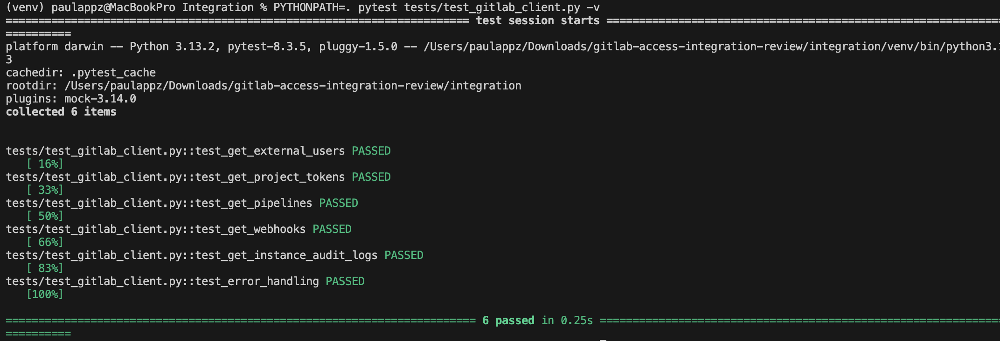

# GitLab Access Audit Tool  
A Python and Postman-based tool to audit third-party access to GitLab.  

## Features  
- List users with external identities (OAuth/SAML).  
- Retrieve project access tokens, CI/CD pipelines, webhooks, and audit logs.  
- Pagination support for large datasets.  
- Postman collection with variable support for GitLab API testing.  
- Pytest test suite for unit testing core functionalities.

## Setup  
1. **Clone the repository**:  
   ```bash
   git clone https://github.com/paulappz/gitlab-access-integration-review.git
   cd gitlab-access-integration-review/integration
   ```
   
2. **Install dependencies**:
   ```bash
   pip install -r requirements.txt
   ```

3. **Configure environment**:
   - Copy `config/.env.example` to `.env`.
   - Update `.env` with your GitLab URL and access token.

## Usage

### Python Script:
```bash
python api/gitlab_client.py --project-id 2 --group-id 4
```
  <details>
  <summary> View sample output  (click to expand)</summary>
  <center>
    
  </center>

  </details>

### Postman:
- Import `api/postman/gitlab_collection.json` into Postman.
- Set environment variables in Postman:
  - `GITLAB_URL`: Your GitLab instance URL.
  - `PRIVATE_TOKEN`: Your Personal Access Token.
  - `PROJECT_ID`: Project ID to audit.
  - `GROUP_ID`: Group ID to audit.
- Run collection in Postman:

  <details>
  <summary> View sample output  (click to expand)</summary>
  <center>
    
  </center>

  </details>


## Endpoints Covered
| Endpoint                               | Description                          |
|----------------------------------------|--------------------------------------|
| `/users?with_identities=true`          | List external users                  |
| `/projects/:id/access_tokens`          | List project tokens                  |
| `/projects/:id/pipelines`              | List project CI/CD pipelines         |
| `/projects/:id/hooks`                  | List project webhooks                |
| `/audit_events`                        | Fetch instance audit logs (Premium)  |

## Testing
Run the test suite using:
```bash
PYTHONPATH=. pytest tests/test_gitlab_client.py -v
```
  <details>
  <summary> View sample output  (click to expand)</summary>
  <center>
    
  </center>

  </details>

## Notes
- Audit logs (`/audit_events`) require GitLab Premium or higher.
- Use the admin token with `read_api` and `read_user` scopes.
