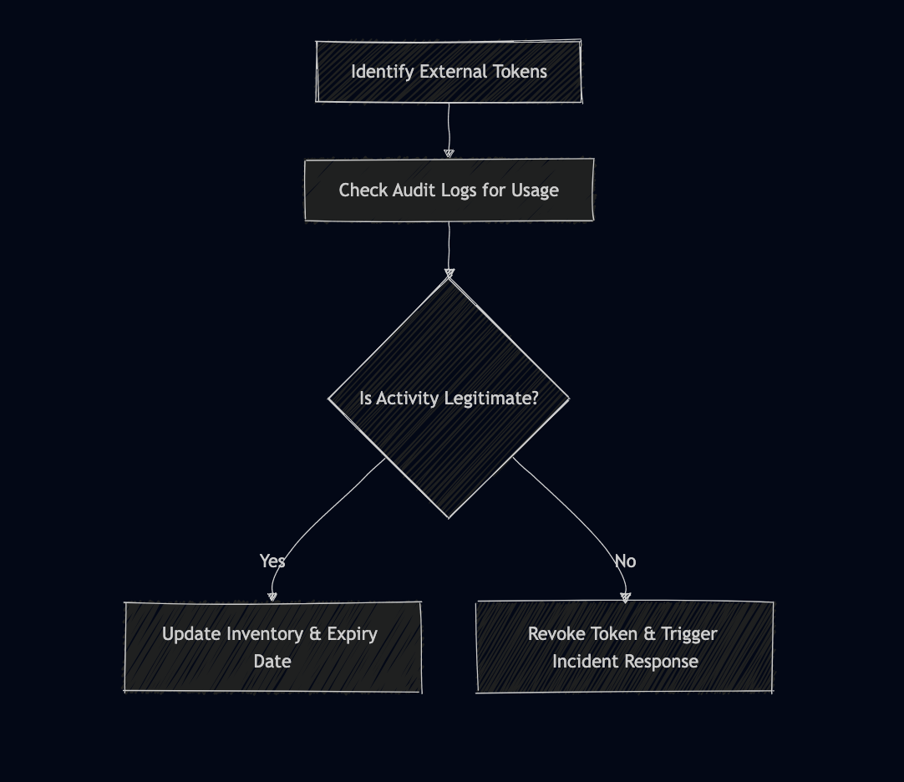

# GitLab Access & Integration Review  
**Objective**: Provide a structured overview of third-party access/integration methods, API usage guidelines, and security best practices.  

---

## 1. Overview  
### Authentication & Access Methods  
- **External Authentication**:  
  - **OAuth 2.0**: Tokens passed via `access_token` or `Authorization` header ([GitLab OAuth Docs](https://docs.gitlab.com/ee/api/oauth2.html)).  
  - **LDAP/Active Directory**: Centralized user management ([LDAP Integration Guide](https://docs.gitlab.com/omnibus/settings/ldap.html)).  
  - **SAML SSO**: Enterprise-grade SSO with IdPs like Okta or Azure AD ([SAML Configuration](https://docs.gitlab.com/ee/user/group/saml_sso/)).  
  - **Personal Access Tokens (PATs)**: Used for API/Git over HTTPS.  
  - **2FA Enforcement**: Mandatory for high-security environments.  

- **Access Control**:  
  - **Instance Level**: Global settings (e.g., enforced 2FA).  
  - **Group Level**: Roles (Guest, Developer, Maintainer) with cascading permissions.  
  - **Project Level**: Granular control over repositories and CI/CD.  

- **Programmatic Access**:  
  - **API Tokens**: Personal, project, or group-level tokens.  
  - **CI/CD Automation**: Trigger pipelines via API calls or webhooks.  

### Integrations & Extensions  
- **Key Integrations**:  
  - **Jenkins**: CI/CD pipeline triggers ([Jenkins Integration](https://docs.gitlab.com/ee/integration/jenkins.html)).  
  - **Slack**: Real-time notifications for merge requests/pipelines.  
  - **Kubernetes**: Auto-deploy to clusters via `.gitlab-ci.yml`.  

- **Permission Models**:  
  - **OAuth Scopes**: Limit third-party app permissions (e.g., `read_user` or `api`).  
  - **Webhooks**: Secured with secret tokens to validate payloads.  

---

## 2. API Endpoints & Data Access  
### Key Endpoints for External Access Monitoring  
| Endpoint | Purpose | Documentation Link |  
|----------|---------|--------------------|  
| `/projects/:id/access_tokens` | List project access tokens | [Project Tokens API](https://docs.gitlab.com/ee/api/project_access_tokens.html) |  
| `/groups/:id/audit_events` | Retrieve group audit logs | [Audit Events API](https://docs.gitlab.com/ee/api/audit_events.html) |  
| `/projects/:id/webhooks` | Manage project webhooks | [Webhooks API](https://docs.gitlab.com/ee/api/projects.html#list-project-hooks) |  
| `/users/:id/projects` | List user-accessible projects | [User Projects API](https://docs.gitlab.com/ee/api/users.html#list-user-projects) |  

### Traversing API Relationships  
To build a complete picture of third-party access:  
1. **Start with `/users`**: Identify users with external tokens.  
2. **Query `/projects/:id/access_tokens`**: List tokens per project.  
3. **Cross-reference `/audit_events`**: Track token usage and API activity.  
4. **Validate `/webhooks`**: Ensure endpoints are secured and active.  

**Example Workflow**:  
```bash
# Get all projects for a user
curl --header "PRIVATE-TOKEN: <your_token>" "https://gitlab.example.com/api/v4/users/:user_id/projects"

# List access tokens for a project
curl --header "PRIVATE-TOKEN: <your_token>" "https://gitlab.example.com/api/v4/projects/:project_id/access_tokens"

```
### Advanced API Query Tips  
- **Pagination**: Use `per_page` and `page` parameters (e.g., `?per_page=100&page=2`).  
- **Filtering**: Narrow results with parameters like `active=true` or `expires_after=2023-12-31`.  
- **Error Handling**: Check for `401 Unauthorized` or `404 Not Found` responses in scripts.  

---

## 3. Security Considerations  
### Common Misconfigurations  
- **Public Project Visibility**: Unintentionally public projects exposing sensitive code.  
- **Unrestricted Runners**: Runners configured without tag restrictions or running in privileged mode.  
- **Overly Permissive Tokens**: Tokens with `api` or `write_repository` scopes granted unnecessarily.  
- **Unvalidated Webhooks**: Webhooks without secret tokens or HTTPS enforcement.  

### CI/CD Pipeline Risks  
- **Insecure Scripts**: Untrusted scripts in `.gitlab-ci.yml` leading to code injection.  
- **Exposed Secrets**: Unmasked variables in job logs or hardcoded credentials.  
- **Malicious Merge Requests**: Pipelines triggered by forks with malicious code.  
 
- **Untrusted Code Execution**: Pipelines executing code from forks or unprotected branches.  
- **Runner Hijacking**: Shared runners reused across projects leading to cross-contamination.  
- **Dependency Poisoning**: Malicious packages in CI/CD scripts or container images. 

---

## 4. Recommendations  
### Best Practices for Secure Integrations  
- **Token Management**:  
  - Rotate tokens quarterly.  
  - Avoid hardcoding tokens; use GitLab’s CI/CD variables or external vaults (e.g., HashiCorp Vault).  
- **Pipeline Security**:  
  - Restrict runner tags to authorized projects.  
  - Use `rules` in `.gitlab-ci.yml` to prevent untrusted code execution.  
  - Validate third-party scripts in pipelines using `allow_failure: false` for critical jobs.  
- **Monitoring**:  
  - Enable audit logging and forward logs to a SIEM (e.g., Splunk, ELK Stack).  
  - Set alerts for abnormal API activity (e.g., bulk repository downloads, frequent access token creation).  

### CI/CD-Specific Guidelines  
- **Runner Hardening**:  
  - Run pipelines in isolated Docker containers or Kubernetes pods.  
  - Disallow privileged mode for runners unless absolutely necessary.  
- **Script Validation**:  
  - Use `only`/`except` clauses to control pipeline triggers (e.g., `only: main`).  
  - Review external contributions with **Merge Request Approval Rules**.  
- **Secrets Protection**:  
  - Mask sensitive variables in job logs using GitLab’s `masked` variable feature.  
  - Use **External Secrets Manager** integrations (e.g., AWS Secrets Manager) for production environments.  

---

## 5. Big-Picture Perspective  
### Methodology for Visibility & Auditing  
1. **Inventory Integrations**:  
   - Maintain a registry of all third-party services (e.g., Jenkins, Slack) with access tokens and scope details.  
   - Use GitLab’s [`/applications` API endpoint](https://docs.gitlab.com/ee/api/applications.html) to track OAuth-authorized apps. 
2. **Automate Monitoring**:  
   - Script periodic checks for stale tokens or misconfigured webhooks using GitLab’s API.  
   - Example: Flag tokens older than 90 days via cron jobs.  
3. **Audit Workflow**:  
   - Quarterly review of group/project membership and access levels.  
   - Validate SAML/SSO configurations with IdP admins (e.g., check certificate expiry).  

### Structured Auditing Approach  
 Click  the `View structured auditing approach` button to view.

  <details>
  <summary> View structured auditing approach (click to expand)</summary>
  <center>
    
  </center>

  </details>
---

## Conclusion  
This report provides actionable steps to map, monitor, and secure third-party access to GitLab. By leveraging APIs, enforcing least privilege, and automating audits, teams can maintain visibility and mitigate risks.  